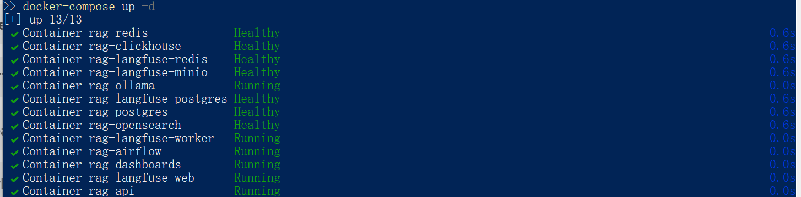
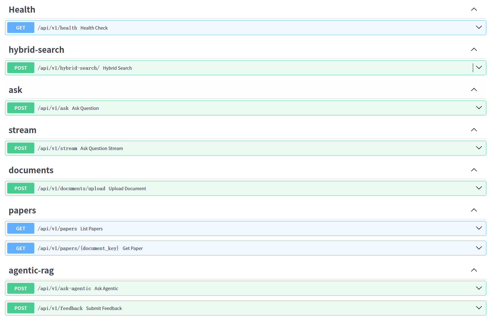
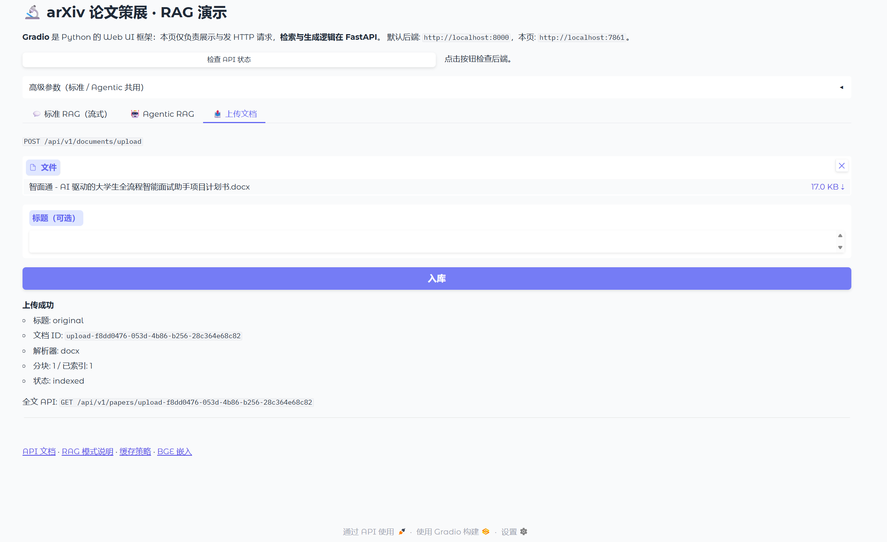
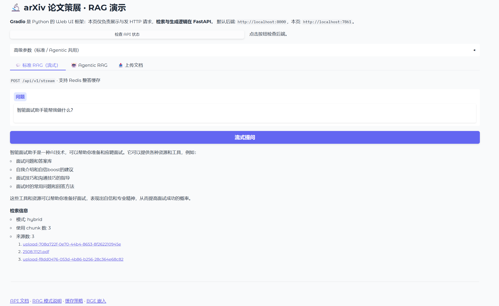
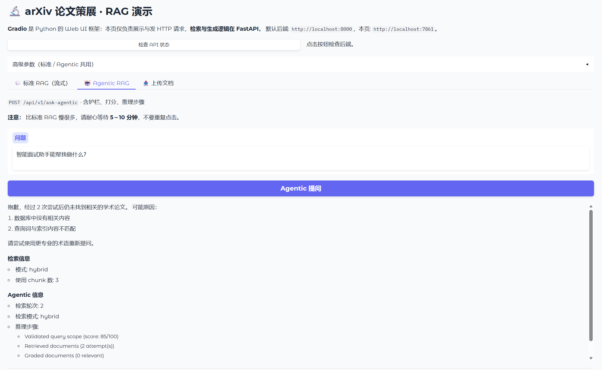
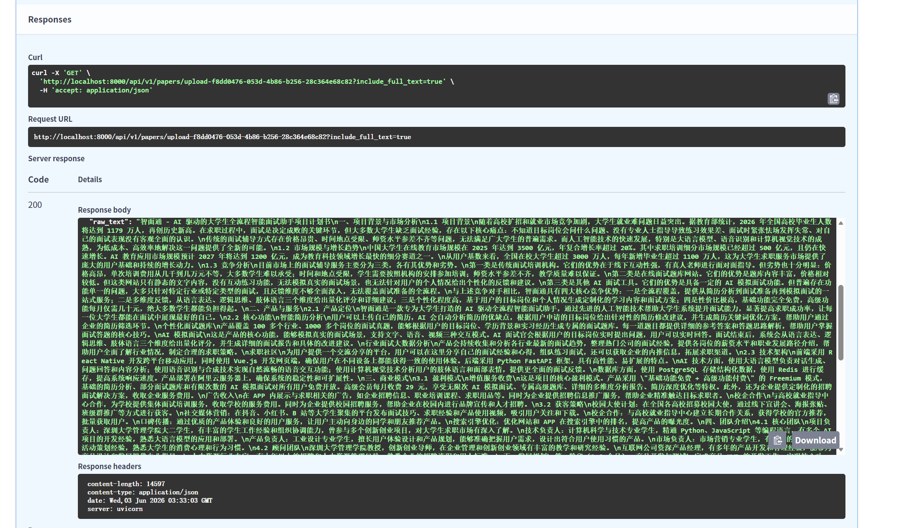

# arXiv Paper Curator · 生产级 RAG 系统

面向 **学术论文 + 私有文档** 的检索增强生成（RAG）：离线摄取（Airflow）、混合检索（OpenSearch + BGE）、标准 / Agentic 双模式问答、Redis 缓存与 Langfuse 可观测。

> 课程原版说明与架构动图见 [README.course.md](README.course.md)

---

## 系统架构

```
  ┌─────────────┐     ┌─────────────┐
  │  arXiv API  │     │  用户上传    │
  └──────┬──────┘     └──────┬──────┘
         │                   │
         ▼                   ▼
  ╔══════════════════════════════════════════╗
  ║  离线摄取  Airflow · Docling · BGE 512维  ║
  ║       拉取/解析 → 分块 → 向量嵌入         ║
  ╚════════════════════╤═════════════════════╝
                       │
         ┌─────────────┴─────────────┐
         ▼                           ▼
  ┌──────────────┐            ┌──────────────┐
  │ PostgreSQL   │            │ OpenSearch   │
  │ 全文·元数据   │            │ BM25+向量RRF │
  └──────┬───────┘            └──────┬───────┘
         │                           │
         └─────────────┬─────────────┘
                       ▼
  ┌────────────────────────────────────────────────────────┐
  │  Gradio :7861  ──HTTP──►  FastAPI :8000                │
  │                              │                         │
  │              ┌───────────────┼───────────────┐         │
  │              ▼               ▼               ▼         │
  │        标准 RAG         Agentic RAG      全文/上传 API  │
  │        /stream          LangGraph                      │
  │              │               │                         │
  │         Redis缓存      多步检索+打分                    │
  │              └───────┬───────┘                         │
  │                      ▼                                 │
  │                 Ollama 本地 LLM                          │
  │                      │                                 │
  │                 Langfuse 追踪                            │
  └────────────────────────────────────────────────────────┘
```

| 数据流 | 说明 |
|--------|------|
| ① 摄取 | arXiv DAG 或用户上传 → 解析入库 → BGE 写入 OpenSearch |
| ② 问答 | Gradio 调 FastAPI → 混合检索 chunk → Ollama 生成 |
| ③ 模式 | **标准 RAG**：检索 1 次 + 生成 1 次，可走 Redis；**Agentic**：护栏/改写/打分/再检索 |
| ④ 全文 | `GET /papers/{id}` 读 PostgreSQL，检索走 OpenSearch |

---

## 个人扩展（相对课程原版）

| 能力 | 说明 |
|------|------|
| **用户上传** | PDF/TXT/MD/DOCX/Excel → PostgreSQL + OpenSearch |
| **BGE 本地向量** | `bge-small-zh-v1.5`（512 维），Docker 挂载 |
| **全文 API** | `GET /api/v1/papers/{id}` 从 PG 读 `raw_text` |
| **Agentic 降级** | 检索 embedding 失败 → BM25 |
| **离线评估** | `scripts/eval_rag.py` + 人工打分 CSV |
| **缓存策略** | 见 [docs/cache.md](docs/cache.md) |
| **默认 LLM** | `llama3.2:3b`（Docker 内存受限时；可换 `1b` 提速） |

---

## 演示截图

### Docker 服务



### Swagger API



### 文档上传



### 标准 RAG



### Agentic RAG



### 全文 API



---

## 技术栈

| 组件 | 用途 |
|------|------|
| FastAPI | REST API |
| PostgreSQL | 元数据 + 全文 |
| OpenSearch | BM25 + kNN + RRF |
| BGE | 512 维本地嵌入 |
| Ollama | 本地 LLM |
| LangGraph | Agentic RAG |
| Redis | 标准 RAG 整答缓存 |
| Langfuse | Trace / 可观测 |
| Airflow | arXiv 定时摄取 |
| Gradio | Web 演示 UI |
| Docker Compose | 一键部署 |

---

## 快速开始

**环境：** Docker Desktop · Python 3.12 + [uv](https://docs.astral.sh/uv/) · 演示前**退出本机 Ollama**（避免占用 `11434`）

```powershell
cd D:\APP\pyCharm\JupyterProject\RAG-projects\production-agentic-rag-course
cp .env.example .env
uv run python scripts/download_bge_model.py

# 终端 1：后端
docker-compose up -d
docker exec rag-ollama ollama list   # 需含 llama3.2:3b

# 终端 2：演示 UI
uv run python gradio_launcher.py
```

| 入口 | 地址 |
|------|------|
| API 文档 | http://localhost:8000/docs |
| Gradio | http://localhost:7861 |

改动了 `src/` 后需重建 API 镜像：`docker build -t production-agentic-rag-course-api . && docker-compose up -d api`

**性能说明：** 本地 CPU 推理下，标准 RAG 约 1～3 分钟、Agentic 约 5～10 分钟较常见；检索通常不足 1 秒。详见 [docs/RAG-modes.md](docs/RAG-modes.md)。

---

## 主要 API

| 方法 | 路径 | 说明 |
|------|------|------|
| POST | `/api/v1/ask` | 标准 RAG（Redis 缓存） |
| POST | `/api/v1/stream` | 流式 RAG |
| POST | `/api/v1/ask-agentic` | Agentic RAG |
| POST | `/api/v1/documents/upload` | 上传文档入库 |
| GET | `/api/v1/papers` | 文档列表 |
| GET | `/api/v1/papers/{id}` | 全文浏览 |

---

## 文档索引

- [RAG 三种模式](docs/RAG-modes.md)
- [Redis 缓存策略](docs/cache.md)
- [BGE 嵌入与 reindex](docs/embeddings.md)
- [离线评估](docs/eval.md)
- [Airflow 流水线](docs/Airflow.md)

---

## 评估

```bash
uv run python scripts/eval_rag.py
# 结果: scripts/eval_results/eval_*.csv
```

---

## 许可证

见 [LICENSE](LICENSE)。课程材料版权归原项目所有。
