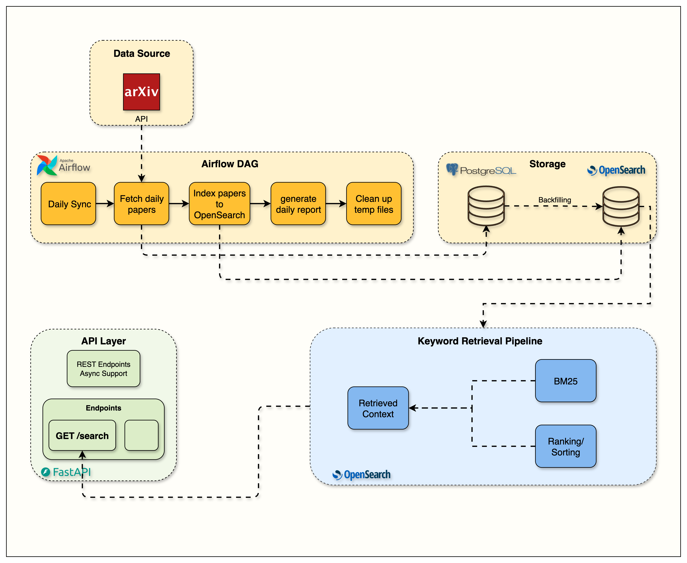
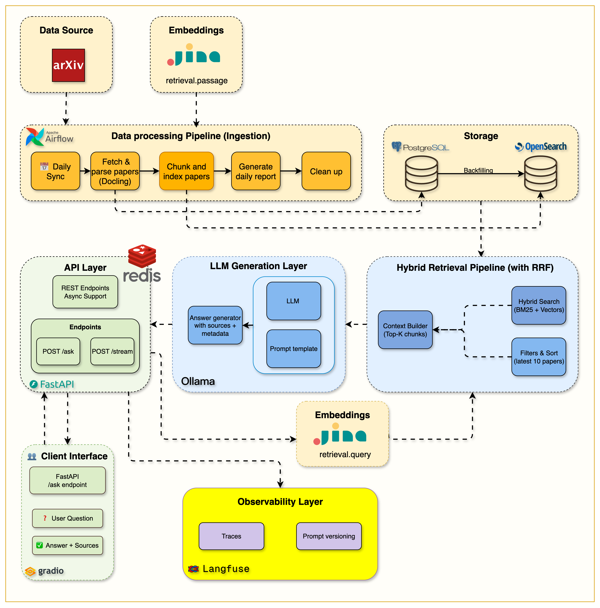

# The Mother of AI Project
## Phase 1 RAG Systems: arXiv Paper Curator

> **中文说明：** 本文为 **英中对照**：**保留全部英文原文**，在主要章节或段落后增加 **中文** 释义，便于阅读。This document is **English–Chinese bilingual**: the **English text is preserved**, with **Chinese** notes added after major sections or paragraphs.

<div align="center">
  <h3>A Learner-Focused Journey into Production RAG Systems</h3>
  <p>Learn to build modern AI systems from the ground up through hands-on implementation</p>
  <p>Master the most in-demand AI engineering skills: <strong>RAG (Retrieval-Augmented Generation)</strong></p>
  <p><strong>中文：</strong>以动手实现为主线，从零构建现代 AI 系统；掌握最吃香的工程技能之一：<strong>RAG（检索增强生成）</strong>。</p>
</div>

<p align="center">
  
  
  
  
  
</p>

</br>

<p align="center">
  <a href="#-about-this-course">
    
  </a>
</p>

## 📖 About This Course

This is a **learner-focused project** where you'll build a complete research assistant system that automatically fetches academic papers, understands their content, and answers your research questions using advanced RAG techniques.

> **中文：** 这是**面向学习者**的项目：你将搭建一套**完整的研究助理系统**，自动获取学术论文、理解内容，并用进阶 **RAG** 技术回答问题。

**The arXiv Paper Curator** will teach you to build a **production-grade RAG system using industry best practices**. Unlike tutorials that jump straight to vector search, we follow the **professional path**: master keyword search foundations first, then enhance with vectors for hybrid retrieval.

> **中文：** **arXiv 论文策展器**将教你用**业界最佳实践**构建**生产级 RAG**。与直接跳入向量检索的教程不同，我们走**专业路径**：先掌握**关键词检索**基础，再用向量增强为**混合检索**。

> **🎯 The Professional Difference:** We build RAG systems the way successful companies do - solid search foundations enhanced with AI, not AI-first approaches that ignore search fundamentals.

> **中文 · 专业差异：** 像成功的公司那样构建 RAG——**扎实的搜索底座 + AI 增强**，而不是忽视搜索基础的「AI 优先」。

By the end of this course, you'll have your own AI research assistant and the deep technical skills to build production RAG systems for any domain.

> **中文：** 课程结束时，你将拥有自己的 AI 研究助理，并具备在**任意领域**搭建生产级 RAG 的扎实能力。

### **🎓 What You'll Build**

- **Week 1:** Complete infrastructure with Docker, FastAPI, PostgreSQL, OpenSearch, and Airflow
- **Week 2:** Automated data pipeline fetching and parsing academic papers from arXiv  
- **Week 3:** Production BM25 keyword search with filtering and relevance scoring
- **Week 4:** Intelligent chunking + hybrid search combining keywords with semantic understanding
- **Week 5:** Complete RAG pipeline with local LLM, streaming responses, and Gradio interface
- **Week 6:** Production monitoring with Langfuse tracing and Redis caching for optimized performance
- **Week 7:** **Agentic RAG with LangGraph and Telegram Bot for mobile access**

> **中文 · 每周交付：** **第 1 周** Docker / FastAPI / PostgreSQL / OpenSearch / Airflow 全套基础设施；**第 2 周** 自动化拉取并解析 arXiv 论文；**第 3 周** 生产级 BM25 与过滤、相关性；**第 4 周** 智能分块 + 关键词与语义混合检索；**第 5 周** 完整 RAG（本地 LLM、流式、Gradio）；**第 6 周** Langfuse 追踪与 Redis 缓存；**第 7 周** LangGraph **智能体 RAG** 与 **Telegram 机器人**。

---

## 🏗️ System Architecture Evolution

> **中文：** 以下为系统架构随课程推进的演进示意（以第 7 周 Agentic RAG + Telegram 为主）。

### Week 7: Agentic RAG & Telegram Bot Integration
<div align="center">
  
  <p><em>Complete Week 7 architecture showing Telegram bot integration with the agentic RAG system</em></p>
  <p><strong>中文：</strong><em>第 7 周完整架构：Telegram 与智能体 RAG 集成示意。</em></p>
</div>

### LangGraph Agentic RAG Workflow
<div align="center">
  
  <p><em>Detailed LangGraph workflow showing decision nodes, document grading, and adaptive retrieval</em></p>
  <p><strong>中文：</strong><em>LangGraph 工作流：决策节点、文档打分、自适应检索等。</em></p>
</div>


**Week 7 Code walkthrough + blog:** [Agentic RAG with LangGraph and Telegram](https://jamwithai.substack.com/p/agentic-rag-with-langgraph-and-telegram)

> **中文：** 第 7 周代码 walkthrough 与博客见上链接。 

**Key Innovations in Week 7:**
- **Intelligent Decision-Making**: Agents evaluate and adapt retrieval strategies
- **Document Grading**: Automatic relevance assessment with semantic evaluation
- **Query Rewriting**: Adaptive query refinement when results are insufficient
- **Guardrails**: Out-of-domain detection prevents hallucination
- **Mobile Access**: Telegram bot for conversational AI on any device
- **Transparency**: Full reasoning step tracking for debugging and trust

> **中文 · 第 7 周要点：** **智能决策**（评估并调整检索策略）、**文档打分**（语义相关性）、**查询改写**（结果不足时自动优化）、**护栏**（域外检测防幻觉）、**移动端**（Telegram 对话）、**可解释**（完整推理步骤便于调试与信任）。

---

## 🚀 Quick Start

### **📋 Prerequisites**
- **Docker Desktop** (with Docker Compose)  
- **Python 3.12+**
- **UV Package Manager** ([Install Guide](https://docs.astral.sh/uv/getting-started/installation/))
- **8GB+ RAM** and **20GB+ free disk space**

> **中文 · 环境要求：** **Docker Desktop**（含 Compose）、**Python 3.12+**、**UV 包管理器**、**≥8GB 内存**与 **≥20GB 磁盘**。

### **⚡ Get Started**

```bash
# 1. Clone and setup
git clone <repository-url>
cd arxiv-paper-curator

# 2. Configure environment (IMPORTANT!)
cp .env.example .env
# The .env file contains all necessary configuration for OpenSearch, 
# arXiv API, and service connections. Defaults work out of the box.
# You need to add Jina embeddings free api key and langfuse keys (check the blogs)

# 3. Install dependencies
uv sync

# 4. Start all services
docker compose up --build -d

# 5. Verify everything works
curl http://localhost:8000/api/v1/health
```

> **中文 · 命令说明：** 1）克隆并进入目录；2）复制 `.env`（含 OpenSearch、arXiv 等配置，默认即可跑通；**第 4 周起**需 Jina 嵌入 API Key，**第 6 周**可选 Langfuse 密钥，详见博客）；3）`uv sync` 安装依赖；4）`docker compose` 启动服务；5）健康检查接口验证。

### **📚 Weekly Learning Path**

| Week | Topic | Blog Post | Code Release |
|------|-------|-----------|--------------|
| **Week 0** | The Mother of AI project - 6 phases | [The Mother of AI project](https://jamwithai.substack.com/p/the-mother-of-ai-project) | - |
| **Week 1** | Infrastructure Foundation | [The Infrastructure That Powers RAG Systems](https://jamwithai.substack.com/p/the-infrastructure-that-powers-rag) | [week1.0](https://github.com/jamwithai/arxiv-paper-curator/releases/tag/week1.0) |
| **Week 2** | Data Ingestion Pipeline | [Building Data Ingestion Pipelines for RAG](https://jamwithai.substack.com/p/bringing-your-rag-system-to-life) | [week2.0](https://github.com/jamwithai/arxiv-paper-curator/releases/tag/week2.0) |
| **Week 3** | OpenSearch ingestion & BM25 retrieval | [The Search Foundation Every RAG System Needs](https://jamwithai.substack.com/p/the-search-foundation-every-rag-system) | [week3.0](https://github.com/jamwithai/arxiv-paper-curator/releases/tag/week3.0) |
| **Week 4** | **Chunking & Hybrid Search** | [The Chunking Strategy That Makes Hybrid Search Work](https://jamwithai.substack.com/p/chunking-strategies-and-hybrid-rag) | [week4.0](https://github.com/jamwithai/arxiv-paper-curator/releases/tag/week4.0) |
| **Week 5** | **Complete RAG system** | [The Complete RAG System](https://jamwithai.substack.com/p/the-complete-rag-system) | [week5.0](https://github.com/jamwithai/arxiv-paper-curator/releases/tag/week5.0) |
| **Week 6** | **Production monitoring & caching** | [Production-ready RAG: Monitoring & Caching](https://jamwithai.substack.com/p/production-ready-rag-monitoring-and) | [week6.0](https://github.com/jamwithai/arxiv-paper-curator/releases/tag/week6.0) |
| **Week 7** | **Agentic RAG & Telegram Bot** | [Agentic RAG with LangGraph and Telegram](https://jamwithai.substack.com/p/agentic-rag-with-langgraph-and-telegram) | [week7.0](https://github.com/jamwithai/arxiv-paper-curator/releases/tag/week7.0) |

> **中文 · 学习路径表：** 各周主题、博客与对应 **GitHub 发布标签（weekx.0）** 见上表；可按标签检出历史周代码。

**📥 Clone a specific week's release:**
```bash
# Clone a specific week's code
git clone --branch <WEEK_TAG> https://github.com/jamwithai/arxiv-paper-curator
cd arxiv-paper-curator
uv sync
docker compose down -v
docker compose up --build -d

# Replace <WEEK_TAG> with: week1.0, week2.0, etc.
```

> **中文：** 将 `<WEEK_TAG>` 换为 `week1.0`、`week2.0` 等以检出特定周版本。

### **📊 Access Your Services**

| Service | URL | Purpose |
|---------|-----|---------|
| **API Documentation** | http://localhost:8000/docs | Interactive API testing |
| **Gradio RAG Interface** | http://localhost:7861 | User-friendly chat interface |
| **Langfuse Dashboard** | http://localhost:3000 | RAG pipeline monitoring & tracing |
| **Airflow Dashboard** | http://localhost:8080 | Workflow management |
| **OpenSearch Dashboards** | http://localhost:5601 | Hybrid search engine UI |

> **中文 · 服务入口：** API 文档、Gradio 聊天、Langfuse 监控、Airflow 编排、OpenSearch 仪表板地址见上表。

#### **NOTE**: Check airflow/simple_auth_manager_passwords.json.generated for Airflow username and password

> **中文：** Airflow 用户名/密码见 `airflow/simple_auth_manager_passwords.json.generated`。
---

## 📚 Week 1: Infrastructure Foundation ✅

**Start here!** Master the infrastructure that powers modern RAG systems.

> **中文：** **从这里开始！** 掌握支撑现代 RAG 的完整基础设施。

### **🎯 Learning Objectives**
- Complete infrastructure setup with Docker Compose
- FastAPI development with automatic documentation and health checks
- PostgreSQL database configuration and management
- OpenSearch hybrid search engine setup
- Ollama local LLM service configuration
- Service orchestration and health monitoring
- Professional development environment with code quality tools

> **中文 · 学习目标：** Docker Compose 全栈、FastAPI 与文档/健康检查、PostgreSQL、OpenSearch、Ollama、服务编排与监控、代码质量工具链。

### **🏗️ Architecture Overview**

<p align="center">
  
</p>

**Infrastructure Components:**
- **FastAPI**: REST endpoints with async support (Port 8000)  
- **PostgreSQL 16**: Paper metadata storage (Port 5432)
- **OpenSearch 2.19**: Search engine with dashboards (Ports 9200, 5601)
- **Apache Airflow 3.0**: Workflow orchestration (Port 8080)
- **Ollama**: Local LLM server (Port 11434)

> **中文 · 组件与端口：** FastAPI **8000**、PostgreSQL **5432**、OpenSearch **9200/5601**、Airflow **8080**、Ollama **11434**。

### **📓 Setup Guide**

```bash
# Launch the Week 1 notebook
uv run jupyter notebook notebooks/week1/week1_setup.ipynb
```

**Completion Guide:** Follow the [Week 1 notebook](notebooks/week1/week1_setup.ipynb) for hands-on setup and verification steps.

> **中文：** 运行第 1 周 notebook，按步骤完成环境与验证。

### **📖 Deep Dive**
**Blog Post:** [The Infrastructure That Powers RAG Systems](https://jamwithai.substack.com/p/the-infrastructure-that-powers-rag) - Detailed walkthrough and production insights

> **中文 · 延伸阅读：** 博客含架构详解与生产环境考量。

---

## 📚 Week 2: Data Ingestion Pipeline ✅

**Building on Week 1 infrastructure:** Learn to fetch, process, and store academic papers automatically.

> **中文：** 在**第 1 周**基础设施之上，学习**自动**拉取、处理并存储学术论文。

### **🎯 Learning Objectives**
- arXiv API integration with rate limiting and retry logic
- Scientific PDF parsing using Docling
- Automated data ingestion pipelines with Apache Airflow
- Metadata extraction and storage workflows
- Complete paper processing from API to database

> **中文 · 学习目标：** arXiv API（限流/重试）、Docling 解析 PDF、Airflow 编排、元数据入库、端到端流水线。

### **🏗️ Architecture Overview**

<p align="center">
  
</p>

**Data Pipeline Components:**
- **MetadataFetcher**: 🎯 Main orchestrator coordinating the entire pipeline
- **ArxivClient**: Rate-limited paper fetching with retry logic
- **PDFParserService**: Docling-powered scientific document processing  
- **Airflow DAGs**: Automated daily paper ingestion workflows
- **PostgreSQL Storage**: Structured paper metadata and content

> **中文 · 流水线组件：** **MetadataFetcher** 编排、**ArxivClient** 拉取、**PDFParserService**（Docling）、**Airflow DAG**、**PostgreSQL** 存储。

### **📓 Implementation Guide**

```bash
# Launch the Week 2 notebook  
uv run jupyter notebook notebooks/week2/week2_arxiv_integration.ipynb
```

**Completion Guide:** Follow the [Week 2 notebook](notebooks/week2/week2_arxiv_integration.ipynb) for hands-on implementation and verification steps.

> **中文：** 打开第 2 周 notebook 完成实现与验证。

### **📖 Deep Dive**
**Blog Post:** [Building Data Ingestion Pipelines for RAG](https://jamwithai.substack.com/p/bringing-your-rag-system-to-life) - arXiv API integration and PDF processing

> **中文 · 延伸阅读：** arXiv 与 PDF 处理详解。

---

## 📚 Week 3: Keyword Search First - The Critical Foundation

**Building on Weeks 1-2 foundation:** Implement the keyword search foundation that professional RAG systems rely on.

> **中文：** 在**第 1–2 周**基础上，实现专业 RAG 依赖的**关键词检索**底座。

### **🎯 Learning Objectives**
- Why keyword search is essential for RAG systems (foundation first approach)
- OpenSearch index management, mappings, and search optimization
- BM25 algorithm and the math behind effective keyword search
- Query DSL for building complex search queries with filters and boosting
- Search analytics for measuring relevance and performance
- Production patterns used by real companies

> **中文 · 学习目标：** 理解关键词检索为何是 RAG 基础、OpenSearch 索引与映射、BM25、查询 DSL、搜索分析与真实公司的工程模式。

### **🏗️ Architecture Overview**

<p align="center">
  
</p>

**Search Infrastructure Components:**
- **OpenSearch Service**: `src/services/opensearch/` - Professional search service implementation
- **Search API**: `src/routers/search.py` - Search API endpoints with BM25 scoring
- **Learning Materials**: `notebooks/week3/` - Complete OpenSearch integration guide
- **Quality Metrics**: Precision, recall, and relevance scoring

> **中文 · 代码与材料：** OpenSearch 服务在 `src/services/opensearch/`；检索相关路由以项目实际代码为准（如 hybrid/ask 等）；notebook 在 `notebooks/week3/`；关注精确率、召回率与相关性。

### **📓 Setup Guide**

```bash
# Launch the Week 3 notebook
uv run jupyter notebook notebooks/week3/week3_opensearch.ipynb
```

**Completion Guide:** Follow the [Week 3 notebook](notebooks/week3/week3_opensearch.ipynb) for hands-on OpenSearch setup and BM25 search implementation.

> **中文：** 按第 3 周 notebook 完成 OpenSearch 与 BM25 实践。

### **📖 Deep Dive**
**Blog Post:** [The Search Foundation Every RAG System Needs](https://jamwithai.substack.com/p/the-search-foundation-every-rag-system) - Complete BM25 implementation with OpenSearch

> **中文 · 延伸阅读：** BM25 与 OpenSearch 完整实现思路。

---

## 📚 Week 4: Chunking & Hybrid Search - The Semantic Layer

**Building on Week 3 foundation:** Add the semantic layer that makes search truly intelligent.

> **中文：** 在**第 3 周**基础上增加**语义层**，实现更「聪明」的检索。

### **🎯 Learning Objectives**
- Section-based chunking with intelligent document segmentation
- Production embeddings with Jina AI integration and fallback strategies
- Hybrid search mastery using RRF fusion for keyword + semantic retrieval
- Unified API design with single endpoint supporting multiple search modes
- Performance analysis and trade-offs between search approaches

> **中文 · 学习目标：** 按章节分块、Jina 等嵌入与回退策略、RRF 融合混合检索、统一 API、性能与权衡分析。

### **🏗️ Architecture Overview**

<p align="center">
  
</p>

**Hybrid Search Infrastructure Components:**
- **Text Chunker**: `src/services/indexing/text_chunker.py` - Section-aware chunking with overlap strategies
- **Embeddings Service**: `src/services/embeddings/` - Production embedding pipeline with Jina AI
- **Hybrid Search API**: `src/routers/hybrid_search.py` - Unified search API supporting all modes
- **Learning Materials**: `notebooks/week4/` - Complete hybrid search implementation guide

> **中文 · 组件：** 分块 `text_chunker.py`、嵌入 `embeddings/`、混合检索 API `hybrid_search.py`、notebook `notebooks/week4/`。

### **📓 Setup Guide**

```bash
# Launch the Week 4 notebook
uv run jupyter notebook notebooks/week4/week4_hybrid_search.ipynb
```

**Completion Guide:** Follow the [Week 4 notebook](notebooks/week4/week4_hybrid_search.ipynb) for hands-on implementation and verification steps.

> **中文：** 跟随第 4 周 notebook 完成混合检索实践。

### **📖 Deep Dive**
**Blog Post:** [The Chunking Strategy That Makes Hybrid Search Work](https://jamwithai.substack.com/p/chunking-strategies-and-hybrid-rag) - Production chunking and RRF fusion implementation

> **中文 · 延伸阅读：** 生产级分块与 RRF 融合。

---

## 📚 Week 5: Complete RAG Pipeline with LLM Integration

**Building on Week 4 hybrid search:** Add the LLM layer that turns search into intelligent conversation.

> **中文：** 在**第 4 周**混合检索之上，加入 **LLM**，把检索变成可对话的 RAG。

### **🎯 Learning Objectives**
- Local LLM integration with Ollama for complete data privacy
- Performance optimization with 80% prompt reduction (6x speed improvement)
- Streaming implementation using Server-Sent Events for real-time responses
- Dual API design with standard and streaming endpoints
- Interactive Gradio interface with advanced parameter controls

> **中文 · 学习目标：** Ollama 本地 LLM、提示词与性能优化、SSE 流式、标准与流式双接口、Gradio 交互界面。

### **🏗️ Architecture Overview**

<p align="center">
  
</p>

**Complete RAG Infrastructure Components:**
- **RAG Endpoints**: `src/routers/ask.py` - Dual endpoints (`/api/v1/ask` + `/api/v1/stream`)
- **Ollama Service**: `src/services/ollama/` - LLM client with optimized prompts
- **System Prompt**: `src/services/ollama/prompts/rag_system.txt` - Optimized for academic papers
- **Gradio Interface**: `src/gradio_app.py` - Interactive web UI with streaming support
- **Launcher Script**: `gradio_launcher.py` - Easy-launch script (runs on port 7861)

> **中文 · 组件：** 问答路由 `ask.py`、Ollama `services/ollama/`、系统提示词 `prompts/rag_system.txt`、Gradio `gradio_app.py`、启动脚本 `gradio_launcher.py`（**7861**）。

### **📓 Setup Guide**

```bash
# Launch the Week 5 notebook
uv run jupyter notebook notebooks/week5/week5_complete_rag_system.ipynb

# Launch Gradio interface
uv run python gradio_launcher.py
# Open http://localhost:7861
```

**Completion Guide:** Follow the [Week 5 notebook](notebooks/week5/week5_complete_rag_system.ipynb) for hands-on LLM integration and RAG pipeline implementation.

> **中文：** 运行 notebook；另开终端执行 `gradio_launcher.py`，浏览器打开 **7861**。

### **📖 Deep Dive**
**Blog Post:** [The Complete RAG System](https://jamwithai.substack.com/p/the-complete-rag-system) - Complete RAG system with local LLM integration and optimization techniques

> **中文 · 延伸阅读：** 完整 RAG 与本地 LLM、优化技巧。

---

## 📚 Week 6: Production Monitoring and Caching

**Building on Week 5 complete RAG system:** Add observability, performance optimization, and production-grade monitoring.

> **中文：** 在**第 5 周**完整 RAG 上增加**可观测性**、**性能优化**与**生产级监控**。

### **🎯 Learning Objectives**
- Langfuse integration for end-to-end RAG pipeline tracing
- Redis caching strategy with intelligent cache keys and TTL management
- Performance monitoring with real-time dashboards for latency and costs
- Production patterns for observability and optimization
- Cost analysis and LLM usage optimization (150-400x speedup with caching)

> **中文 · 学习目标：** Langfuse 端到端追踪、Redis 缓存键与 TTL、延迟与成本看板、可观测性模式、缓存带来的数量级加速（文中示例）。

### **🏗️ Architecture Overview**

<p align="center">
  
</p>

**Production Infrastructure Components:**
- **Langfuse Service**: `src/services/langfuse/` - Complete tracing integration with RAG-specific metrics
- **Cache Service**: `src/services/cache/` - Redis client with exact-match caching and graceful fallback
- **Updated Endpoints**: `src/routers/ask.py` - Integrated tracing and caching middleware
- **Docker Config**: `docker-compose.yml` - Added Redis service and Langfuse local instance
- **Learning Materials**: `notebooks/week6/` - Complete monitoring and caching implementation guide

> **中文 · 组件：** Langfuse `services/langfuse/`、缓存 `services/cache/`、路由中集成追踪与缓存；Compose 中 Redis/Langfuse；材料见 `notebooks/week6/`。（文中 `docker-compose.yml` 指 Compose 配置，本仓库多为 `compose.yml`。）

### **📓 Setup Guide**

```bash
# Launch the Week 6 notebook
uv run jupyter notebook notebooks/week6/week6_cache_testing.ipynb
```

**Completion Guide:** Follow the [Week 6 notebook](notebooks/week6/week6_cache_testing.ipynb) for hands-on Langfuse tracing and Redis caching implementation.

> **中文：** 按第 6 周 notebook 实践 Langfuse 与 Redis。

### **📖 Deep Dive**
**Blog Post:** [Production-ready RAG: Monitoring & Caching](https://jamwithai.substack.com/p/production-ready-rag-monitoring-and) - Production-ready RAG with monitoring and caching

> **中文 · 延伸阅读：** 生产可观测性与缓存。

---

## 📚 Week 7: Agentic RAG with LangGraph and Telegram Bot

**Building on Week 6 production system:** Add intelligent reasoning, multi-step decision-making, and Telegram bot integration for mobile-first AI interactions.

> **中文：** 在**第 6 周**生产系统上，加入**多步推理**、**决策编排**与 **Telegram**，偏移动优先交互。

### **🎯 Learning Objectives**
- LangGraph workflows for state-based agent orchestration with decision nodes
- Guardrail implementation for query validation and domain boundary detection
- Document grading with semantic relevance evaluation
- Query rewriting for automatic query refinement and better retrieval
- Adaptive retrieval with multi-attempt retrieval and intelligent fallback
- Telegram bot integration with async operations and error handling
- Reasoning transparency by exposing agent decision-making process

> **中文 · 学习目标：** LangGraph 状态机与工作流、护栏与域检测、文档打分、查询改写、自适应多轮检索、Telegram 异步与错误处理、暴露推理过程。

### **🏗️ Architecture Overview**

<p align="center">
  
</p>

**Agentic RAG Infrastructure Components:**
- **Agent Nodes**: `src/services/agents/nodes/` - Guardrail, retrieve, grade, rewrite, and generate nodes
- **Workflow Orchestration**: `src/services/agents/agentic_rag.py` - LangGraph workflow coordination
- **Telegram Bot**: `src/services/telegram/` - Command handlers and message processing
- **Agentic Endpoint**: `src/routers/agentic_ask.py` - Agentic RAG API endpoint
- **Learning Materials**: `notebooks/week7/` - Week 7 learning materials and examples

> **中文 · 组件：** 节点 `agents/nodes/`、编排 `agentic_rag.py`、Telegram `services/telegram/`、接口 `agentic_ask.py`、notebook `notebooks/week7/`。

### **📓 Setup Guide**

```bash
# Launch the Week 7 notebook
uv run jupyter notebook notebooks/week7/week7_agentic_rag.ipynb
```

**Completion Guide:** Follow the [Week 7 notebook](notebooks/week7/week7_agentic_rag.ipynb) for hands-on LangGraph agentic RAG and Telegram bot implementation.

> **中文：** 按第 7 周 notebook 实践智能体 RAG 与 Telegram。

### **📖 Deep Dive**
**Blog Post:** [Agentic RAG with LangGraph and Telegram](https://jamwithai.substack.com/p/agentic-rag-with-langgraph-and-telegram) - Building intelligent agents with decision-making, adaptive retrieval, and mobile access

> **中文 · 延伸阅读：** 决策、自适应检索与移动端。

---

## ⚙️ Configuration

**Setup:**
```bash
cp .env.example .env
# Edit .env for your environment
```

**Key Variables:**
- `JINA_API_KEY` - Required for Week 4+ (hybrid search with embeddings)
- `TELEGRAM__BOT_TOKEN` - Required for Week 7 (Telegram bot integration)
- `LANGFUSE__PUBLIC_KEY` & `LANGFUSE__SECRET_KEY` - Optional for Week 6 (monitoring)

> **中文 · 配置要点：** 复制 `.env.example` 为 `.env`；**JINA_API_KEY** 第 4 周起混合检索必需；**TELEGRAM__BOT_TOKEN** 第 7 周机器人；**LANGFUSE** 密钥第 6 周可选（监控）。完整项见 [.env.example](.env.example)。

**Complete Configuration:** See [.env.example](.env.example) for all available options and detailed documentation.

---

## 🔧 Reference & Development Guide

### **🛠️ Technology Stack**

| Service | Purpose | Status |
|---------|---------|--------|
| **FastAPI** | REST API with automatic docs | ✅ Ready |
| **PostgreSQL 16** | Paper metadata and content storage | ✅ Ready |
| **OpenSearch 2.19** | Hybrid search engine (BM25 + Vector) | ✅ Ready |
| **Apache Airflow 3.0** | Workflow automation | ✅ Ready |
| **Jina AI** | Embedding generation (Week 4) | ✅ Ready |
| **Ollama** | Local LLM serving (Week 5) | ✅ Ready |
| **Redis** | High-performance caching (Week 6) | ✅ Ready |
| **Langfuse** | RAG pipeline observability (Week 6) | ✅ Ready |

> **中文 · 技术栈表：** 各服务用途与周次见上表；开发工具含 UV、Ruff、MyPy、Pytest、Docker Compose。

**Development Tools:** UV, Ruff, MyPy, Pytest, Docker Compose

### **🏗️ Project Structure**

```
arxiv-paper-curator/
├── src/                    # Main application code
│   ├── routers/            # API endpoints (search, ask, papers)
│   ├── services/           # Business logic (opensearch, ollama, agents, cache)
│   ├── models/             # Database models (SQLAlchemy)
│   ├── schemas/            # Pydantic validation schemas
│   └── config.py           # Environment configuration
├── notebooks/              # Weekly learning materials (week1-7)
├── airflow/                # Workflow orchestration (DAGs)
├── tests/                  # Test suite
└── compose.yml             # Docker service orchestration
```

> **中文 · 目录结构：** `src` 主程序；`notebooks` 每周教程；`airflow` DAG；`tests` 测试；`compose.yml` 编排容器。

### **📡 API Endpoints Reference**

| Endpoint | Method | Description | Week |
|----------|--------|-------------|------|
| `/health` | GET | Service health check | Week 1 |
| `/api/v1/papers` | GET | List stored papers | Week 2 |
| `/api/v1/papers/{id}` | GET | Get specific paper | Week 2 |
| `/api/v1/search` | POST | BM25 keyword search | Week 3 |
| `/api/v1/hybrid-search/` | POST | Hybrid search (BM25 + Vector) | **Week 4** |

> **中文 · 接口：** 健康检查、论文列表/详情、BM25 搜索、混合检索等；完整列表以运行中的 **http://localhost:8000/docs** 为准。

**API Documentation:** Visit http://localhost:8000/docs for interactive API explorer

### **🔧 Essential Commands**

#### **Using the Makefile** (Recommended)
```bash
# View all available commands
make help

# Quick workflow
make start         # Start all services
make health        # Check all services health
make test          # Run tests
make stop          # Stop services
```

#### **All Available Commands**
| Command | Description |
|---------|-------------|
| `make start` | Start all services |
| `make stop` | Stop all services |
| `make restart` | Restart all services |
| `make status` | Show service status |
| `make logs` | Show service logs |
| `make health` | Check all services health |
| `make setup` | Install Python dependencies |
| `make format` | Format code |
| `make lint` | Lint and type check |
| `make test` | Run tests |
| `make test-cov` | Run tests with coverage |
| `make clean` | Clean up everything |

> **中文 · Makefile：** `make help` 查看全部；`start/stop/restart/status/logs/health/setup/format/lint/test/test-cov/clean` 等见上表。

#### **Direct Commands** (Alternative)
```bash
# If you prefer using commands directly
docker compose up --build -d    # Start services
docker compose ps               # Check status
docker compose logs            # View logs
uv run pytest                 # Run tests
```

> **中文 · 直接命令：** 亦可用 `docker compose` 与 `uv run pytest` 等手动执行。

### **🎓 Target Audience**
| Who | Why |
|-----|-----|
| **AI/ML Engineers** | Learn production RAG architecture beyond tutorials |
| **Software Engineers** | Build end-to-end AI applications with best practices |
| **Data Scientists** | Implement production AI systems using modern tools |

> **中文 · 适合谁：** AI/ML 工程师、希望做端到端 AI 应用的软件工程师、转向生产落地的数据科学家等。

---

## 🛠️ Troubleshooting

**Common Issues:**
- **Services not starting?** Wait 2-3 minutes, check `docker compose logs`
- **Port conflicts?** Stop other services using ports 8000, 8080, 5432, 9200
- **Memory issues?** Increase Docker Desktop memory allocation

> **中文 · 常见问题：** 启动慢则等待 2–3 分钟并看日志；端口占用则释放 **8000/8080/5432/9200**；内存不足则调高 Docker 分配。

**Get Help:**
- Check the comprehensive Week 1 notebook troubleshooting section
- Review service logs: `docker compose logs [service-name]`
- Complete reset: `docker compose down --volumes && docker compose up --build -d`

> **中文 · 求助步骤：** 先看第 1 周 notebook 排错；`docker compose logs [服务名]`；必要时 **删卷重建**（会清空数据）。

---

## 💰 Cost Structure

**This course is completely free!** You'll only need minimal costs for optional services:
- **Local Development:** $0 (everything runs locally)
- **Optional Cloud APIs:** ~$2-5 for external LLM services (if chosen)

> **中文 · 费用：** 课程本身免费；本地开发 **$0**；若选用外部云 LLM 等可选服务，可能少量花费。

---

<div align="center">
  <h3>🎉 Ready to Start Your AI Engineering Journey?</h3>
  <p><strong>Begin with the Week 1 setup notebook and build your first production RAG system!</strong></p>
  
  <p><em>For learners who want to master modern AI engineering</em></p>
  <p><strong>中文：</strong>准备好开始了吗？从<strong>第 1 周环境 notebook</strong> 出发，搭建你的第一个生产级 RAG 系统。</p>
  <p><strong>Built with love by <a href="https://www.linkedin.com/in/shirin-khosravi-jam/">Shirin Khosravi Jam</a> & <a href="https://www.linkedin.com/in/shantanuladhwe/">Shantanu Ladhwe</a></strong></p>
</div>

---

## Star History

[](https://star-history.com/#jamwithai/production-agentic-rag-course&Date)

---

## 📄 License

MIT License - see [LICENSE](LICENSE) file for details.

> **中文：** MIT 许可证，详见 [LICENSE](LICENSE)。
